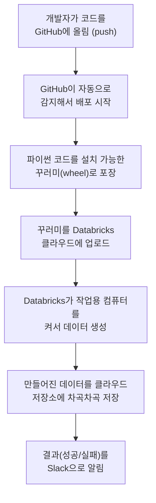

# ecommerce-data-generator

> 가짜 이커머스(온라인 쇼핑몰) 데이터를 자동으로 만들어서 Databricks에 올려주는 프로젝트입니다.

## 한 줄 요약

**"진짜처럼 보이는 가짜 쇼핑몰 데이터(회원, 상품, 주문 등)를 컴퓨터가 자동으로 만들어 클라우드에 차곡차곡 쌓아주는 자동화 도구"** 입니다.

데이터 분석이나 교육 연습을 하려면 데이터가 필요한데, 실제 회사 데이터는 보안 문제로 쓰기 어렵습니다. 그래서 이 프로젝트는 **실제와 똑같이 생긴 가짜 데이터**를 만들어 줍니다.

---

## 이게 왜 필요한가요?

데이터 분석을 배우거나 시스템을 테스트하려면 "연습용 데이터"가 필요합니다.

- 실제 고객 데이터는 개인정보라서 함부로 못 씁니다.
- 너무 깔끔한 데이터는 현실과 달라서 연습이 안 됩니다.

그래서 이 도구는 **현실처럼 적당히 지저분한** 가짜 데이터를 만듭니다.
예를 들면:

- 일부 회원은 성별 정보가 비어 있고 (실제로도 입력 안 하는 사람이 많죠)
- 일부 상품은 이미 단종되었고
- 주문은 저녁 시간과 연말(블랙프라이데이, 12월)에 몰리도록

이렇게 **진짜 쇼핑몰처럼** 만들어 줍니다.

---

## 어떤 데이터를 만드나요?

크게 두 종류의 데이터를 만듭니다.

### 1. 기본 정보 (변하지 않는 것들)

| 데이터 | 설명 | 예시 규모 |
|--------|------|-----------|
| **카테고리** | 상품 분류 (전자제품 > 컴퓨터 > 노트북 같은 3단계 구조) | - |
| **회원** | 가입한 고객 정보 (이름, 국가, 등급 등) | 약 10만 명 |
| **상품** | 판매하는 물건 (가격, 브랜드, 단종 여부 등) | 약 1만 개 |

### 2. 활동 기록 (계속 쌓이는 것들)

| 데이터 | 설명 | 예시 규모 |
|--------|------|-----------|
| **주문** | 누가 언제 주문했는지 | 약 300만 건 |
| **주문 상세** | 주문 안에 어떤 상품이 몇 개 담겼는지 | 주문보다 많음 |
| **행동 로그** | 누가 어떤 상품을 보고, 검색하고, 장바구니에 담았는지 (클릭스트림) | 약 1,600만 건 |

> 만들어진 데이터는 `Parquet`이라는 형식의 파일로 저장됩니다. 엑셀 파일과 비슷하지만, 대용량 데이터를 빠르게 다루기 위한 전문 형식입니다.

---

## 전체 그림


이 프로젝트는 위 세 가지가 한 묶음으로 들어 있습니다. 이 "한 묶음"을 Databricks 용어로 **번들(Bundle)** 이라고 부릅니다.

---

## 폴더 구조 (어디에 뭐가 있나요?)

```
ecommerce-data-generator/
│
├── databricks.yml             ← 프로젝트 전체 설정 (가장 중요한 설계도)
│
├── src/ecommerce_generator/    ← ① 실제 데이터를 만드는 파이썬 코드
│   ├── main.py                 ← 시작점 (여기서부터 실행됨)
│   ├── generate_users.py       ← 회원 만들기
│   ├── generate_products.py    ← 상품 만들기
│   ├── generate_orders.py      ← 주문 만들기
│   ├── ... (카테고리, 주문상세 등)
│   └── config.yml              ← 몇 명/몇 개 만들지 등 기본 설정값
│
├── configuration/              ← ② 클라우드(Databricks) 환경 설정
│   ├── clusters/               ← 작업용 컴퓨터(클러스터) 사양
│   ├── unity-catalogs/         ← 데이터 저장 창고(카탈로그·볼륨)
│   ├── jobs/                   ← 자동 실행 작업(Job) 정의
│   └── variables.yml           ← 자주 바뀌는 값들 (기간, 계정 등)
│
└── .github/workflows/          ← ③ 자동 배포 설정 (GitHub Actions)
    └── deploy-bundle.yml
```

---

## 어떻게 작동하나요? (작동 순서)



> 사람이 직접 손댈 필요 없이, 코드를 올리기만 하면 위 과정이 자동으로 돌아갑니다.

---

## 배포 환경 (어디에 올라가나요?)

이 프로젝트에는 두 가지 환경이 있습니다.

| 환경 | 언제 배포되나요? | 용도 |
|------|------------------|------|
| **dev (개발)** | `main` 가지에 코드가 올라갈 때 | 개발·테스트용 |
| **prd (운영)** | `v1.0` 같은 버전 태그를 붙일 때 | 실제 운영용 |

---

## 사용된 주요 기술

코드를 모르셔도 됩니다. 참고용으로만 봐주세요.

- **Python (파이썬)** — 데이터를 만드는 프로그래밍 언어
- **Polars / NumPy** — 대량의 데이터를 빠르게 계산하는 도구
- **Databricks Asset Bundle** — 클라우드 데이터 작업을 한 묶음으로 관리하는 도구
- **GitHub Actions** — 코드를 올리면 자동으로 배포해주는 자동화 도구
- **uv** — 파이썬 꾸러미를 빠르게 빌드/관리하는 도구

---

## 사용 방법 (개발자용)

> 컴퓨터에 개발 환경(Python 3.12, uv)이 준비된 분들을 위한 안내입니다.

### 1. 준비 — 의존성 설치

이 프로젝트는 [uv](https://github.com/astral-sh/uv)로 패키지를 관리합니다.

```bash
# 런타임 + 개발용(테스트·린트) 의존성을 한 번에 설치
uv sync --dev
```

### 2. 데이터 생성 (로컬 실행)

`generate-data` 명령으로 데이터를 만듭니다. 기간과 저장 위치는 반드시 지정해야 합니다.

```bash
uv run generate-data \
  --start-date 2025-05-11 \
  --end-date 2026-05-11 \
  --output-volume ./output/raw
```

실행하면 저장 위치 아래에 이렇게 쌓입니다.

```
output/raw/
├── categories.parquet      # 카테고리
├── users.parquet           # 회원
├── products.parquet        # 상품
├── orders/                 # 주문 (날짜별 dt 폴더로 나뉨)
│   └── dt=2025-11-28/ ...
├── order_items/            # 주문 상세 (날짜별)
└── events/                 # 행동 로그 (날짜별)
```

### 옵션 한눈에 보기

| 옵션 | 필수 | 설명 |
|------|------|------|
| `--start-date` | 필수 | 데이터 기간 시작일 (YYYY-MM-DD) |
| `--end-date` | 필수 | 데이터 기간 종료일 (YYYY-MM-DD) |
| `--output-volume` | 필수 | 결과를 저장할 폴더 경로 |
| `--seed` | 선택 | 난수 시드. 같은 값이면 항상 같은 데이터가 나옴 |
| `--users` | 선택 | 회원 수 |
| `--products` | 선택 | 상품 수 |
| `--null-rate-gender` | 선택 | 회원 성별을 비울 비율 |
| `--null-rate-brand` | 선택 | 상품 브랜드를 비울 비율 |
| `--discontinued-rate` | 선택 | 상품 단종 비율 |
| `--browse-sessions-per-user` | 선택 | 회원당 평균 둘러보기 세션 수 |
| `--max-events-per-session` | 선택 | 세션당 행동 로그 최대 개수 |
| `--null-rate-search` | 선택 | 검색어를 비울 비율 |

> 선택 옵션을 지정하지 않으면 `src/ecommerce_generator/config.yml`의 기본값이 쓰입니다.

빠르게 시험해 보려면 규모를 작게 잡으면 됩니다.

```bash
uv run generate-data \
  --start-date 2025-01-01 --end-date 2025-12-31 \
  --output-volume ./output/raw \
  --users 2000 --products 300
```

### 3. 기본값 바꾸기

만들 데이터의 양이나 "지저분한 데이터" 비율의 기본값은
`src/ecommerce_generator/config.yml`에서 조정할 수 있습니다.
매 실행마다 다르게 주고 싶을 때는 위의 명령 옵션을 쓰면 됩니다.

### 4. 테스트와 코드 점검

```bash
uv run pytest        # 전체 테스트
uv run ruff check .  # 코드 스타일 점검
```

### 5. Databricks에 배포 (개발 환경)

```bash
databricks bundle deploy -t dev
```
